<div align="center">
  
  
  # BOBS Studio
  
  ### Bun Open Broadcasting Software
  
  _A high-fidelity, web-based broadcasting studio and real-time composition framework built with TypeScript, Bun, and FFmpeg._

  [](https://bun.sh)
  [](https://typescriptlang.org)
  [](https://react.dev)
  [](https://ffmpeg.org)
</div>

---

## 📖 Introduction

**BOBS Studio** is an open-source web-based live composition and video broadcasting framework designed to replicate professional desktop OBS Studio workflows directly inside the browser. It features a dual-canvas **Studio Mode** layout, an interactive drag-and-resize source editor, a multi-channel Web Audio mixer with live decibel soundbars, and a native Bun-managed FFmpeg backend that handles high-performance real-time recording and RTMP/SRT streaming ingestion.

---

## 🚀 Key Features

* 🖥️ **Interactive WYSIWYG Canvas Editor**: Create customized scene overlays. Click to select sources, drag to reposition, and use 8-point handles to scale, crop, and adjust size directly on the Preview canvas.
* 🎛️ **Web Audio Mixing Console**: Connect and mix microphone hardware, screenshare system sound, and looping video elements. Features dual vertical visual LED decibel bars (green-yellow-red) calculated at 60fps via standard `AnalyserNode` frequency peak data.
* 🎭 **Double-Canvas Studio Mode**: Toggle between a single monitor and professional dual screens. Edit your layouts in **Preview** and smoothly swap them into **Program** with transition filters like **Cut**, **Fade**, and **Slide**.
* 🌐 **Web-NDI (Distributed Previews)**: Serve an ultra-low latency, standalone glassmorphic preview monitor at `/view` allowing remote previewing of the Program output with sub-second lag across the local network. Uses automatic MKV initialization header caching for instant late-join synchronization.
* 🎮 **JSON-RPC Remote Control**: An interactive JSON-RPC 2.0 WebSocket channel at `/ws/rpc` supporting robust automation and remote control over scenes, audio volume, source visibility, transitions, and stream/recording telemetry.
* 🎥 **Native Virtual Camera Loopback**: Broadcaster-controlled cross-platform virtual webcam loopback (via DirectShow on Windows and `v4l2loopback` on Linux) piped directly from the backend's FFmpeg pipeline, making BOBS Studio instantly available as a camera input in Zoom, MS Teams, Discord, and Slack.
* 📷 **Rich Multi-Source Ingestion**: Add Screenshare windows, Webcam feeds, Image overlays, Color fields, Video files, and customizable Title Text overlays to any scene.
* ⚡ **Bun + FFmpeg real-time Streaming & Recording Pipeline**: The frontend packages the composed canvas output and mixed audio into WebM slices at 100ms intervals, streaming them over WebSockets. The Bun backend pipes the binary slices directly into the standard input of an active `ffmpeg` subprocess to write high-quality `.mp4` recordings locally or push live FLV streams to RTMP ingestion portals (Twitch, YouTube, Kick, Facebook).
* 📂 **Local Recordings Browser**: Directly view, manage, and download recorded MP4 files from your backend's local folder within the settings menu.

---

## 📐 Architecture & Flow

```mermaid
graph TD
    subgraph Browser Client
        A[HTML5 Preview Canvas] -->|WYSIWYG Layout Editor| B[Compositor Engine]
        B -->|Scene Transition Overlay| C[HTML5 Program Canvas]
        D[Microphone & System Audio] -->|AudioContext Nodes| E[Web Audio Mixer]
        C -->|canvas.captureStream| F[MediaRecorder Pipeline]
        E -->|audioMixer.getMixedStream| F
    end

    subgraph Bun Backend Server
        F -->|WebSocket Binary Slices 100ms| G[Bun.serve WebSockets /ws]
        G -->|Dynamic stdin pipe| H[FFmpeg Subprocess]
        H -->|Direct Multiplex & Transcode| I[Local MP4 Files]
        H -->|Push FLV Stream| J[RTMP Stream Ingest YouTube/Twitch]
    end

    style Browser Client fill:#0E1325,stroke:#5F5DEC,stroke-width:2px;
    style Bun Backend Server fill:#0F1A24,stroke:#10B981,stroke-width:2px;
```



---

## 📁 Repository Layout

BOBS Studio is configured as a lightweight **Bun Workspace Monorepo**:

```
bobs/
├── package.json               # Root workspace scripts & dependencies
├── tsconfig.json              # Workspace-wide TypeScript rules
├── 0logov3.png                # Official logo asset
├── packages/
│   ├── shared/                # Common types & WebSocket protocol definitions
│   │   └── src/index.ts       
│   │
│   ├── backend/               # Bun HTTP/WebSocket server & FFmpeg integration
│   │   ├── src/index.ts       # Bun.serve logic
│   │   ├── src/ffmpeg.ts      # Subprocess lifecycle wrapper
│   │   └── recordings/        # Output directory for locally recorded MP4s
│   │
│   └── frontend/              # Vite + React + TS dashboard application
│       ├── src/App.tsx        # Main studio layout & WebSocket streamer
│       ├── src/utils/         # Compositor.ts (Canvas) & AudioMix.ts (Web Audio)
│       └── src/components/    # Modal selectors & Settings pane
```

---

## 🛠️ Getting Started

### Prerequisites
* **Bun**: Install Bun by running `curl -fsSL https://bun.sh/install | bash` (macOS/Linux) or `powershell -c "irm bun.sh/install.ps1 | iex"` (Windows).
* **FFmpeg**: Ensure `ffmpeg` is installed and available in your system's global environmental path.

### 1. Installation
Clone this repository and install the monorepo workspace dependencies from the root directory:
```bash
bun install
```

---

### 2. Run in Developer Mode (Local Hot-Reloading)
For active development, run the front-end and backend servers concurrently:

1. **Launch the WebSocket backend server** (listens on port 3001):
   ```bash
   bun run dev:backend
   ```
2. **Launch the Vite React dev server** (runs on port 5173):
   ```bash
   bun run dev:frontend
   ```
3. Open your browser and navigate to **`http://localhost:5173`**.

---

### 3. Run in Production Mode (Unified Single-Port Delivery)
Build the compiled, optimized frontend asset bundle and run the unified Bun server, which hosts both the frontend site and WebSocket streaming channels on a single port:

1. **Compile and build frontend assets**:
   ```bash
   bun run build
   ```
2. **Start the production Bun server** (listens on port 3001):
   ```bash
   bun run start
   ```
3. Open your browser and navigate to **`http://localhost:3001`**.

---

## ⚙️ Technical Specifications

| Parameter | Default Value | Customizable In settings |
| :--- | :--- | :--- |
| **Canvas Resolution** | `1280x720` (HD 720p) | Yes (`1920x1080`, `1280x720`, `854x480`) |
| **Base Framerate** | `30 FPS` | Yes (`30 FPS` or `60 FPS`) |
| **Video Bitrate** | `3000 kbps` | Yes (Configurable in settings) |
| **Audio Bitrate** | `128 kbps` | Yes (Configurable in settings) |
| **Video Codec** | `H.264 (libx264)` | Transcoded natively via backend FFmpeg |
| **Audio Codec** | `AAC` | Transcoded natively via backend FFmpeg |
| **Streaming Output** | `FLV over RTMP` | Yes (Any custom RTMP/RTMPS server) |

---

## 🔒 License
This project is licensed under the MIT License.
